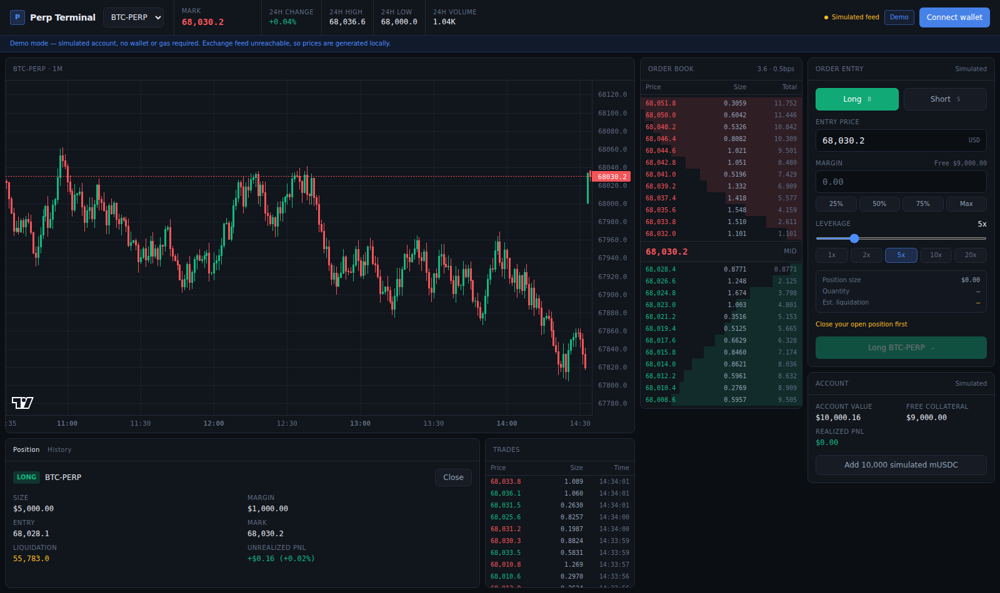

# Perp Terminal

A professional-grade perpetuals trading interface for an EVM testnet. Live orderbook and chart over WebSockets, on-chain margin and positions via ethers.js v6.



**[Live demo](#)** · Replace with your Vercel URL once deployed.

---

## What this is

Most portfolio dApps stop at "connect wallet, read a balance." This one is built around the parts that are actually hard in a production trading front end:

- **A high-frequency data pipeline that doesn't melt the main thread.** The depth stream fires every 100ms and the trade stream is unbounded. Every message writes to a private buffer; a single `requestAnimationFrame` flush commits to the store. Render rate is capped at the display refresh rate no matter how hard the socket pushes.
- **Reconnection that behaves under failure.** Exponential backoff with jitter, capped retries, and a heartbeat that marks the feed *stale* when the socket is open but has stopped delivering — because a trader acting on a frozen book is the failure mode that matters.
- **An orderbook that aggregates like a real venue.** Binance quotes BTC in $0.01 increments; rendering those raw at display precision produces rows that all read the same price and a spread that rounds to zero. Levels are bucketed by tick size with sizes summed — bids floored, asks ceiled, so a bucket never claims liquidity at a better price than exists and the two sides can't collapse onto a fake zero spread.
- **A transaction lifecycle that tells the truth.** `signing → pending → confirmed → failed` as an explicit state machine, not a boolean spinner. "Your wallet is asking you to sign" and "it's on the network, waiting for a block" are different things, and the UI says which.
- **Optimistic updates with a real reconciliation point.** Positions paint instantly on submit and roll back if the chain rejects. The chain stays the single source of truth.
- **A demo mode that works with no wallet.** Full terminal, simulated account, live prices. If the exchange feed is unreachable (corporate proxy, regional restrictions), a local simulator takes over — clearly labelled *Simulated feed*, never passed off as live.

## Stack

| Layer | Choice | Why |
|---|---|---|
| Framework | Next.js 16 (App Router) | |
| Language | TypeScript, strict | |
| Chain | ethers.js v6 | `BrowserProvider` for signing, `JsonRpcProvider` for wallet-free reads |
| Contracts | Solidity 0.8.24 + Hardhat | |
| State | Zustand | Small stores, no provider tree, selector-level subscriptions |
| Charts | Lightweight Charts | Owns its canvas; candle updates bypass React entirely |
| Styling | Tailwind | Dark, dense, `tabular-nums` everywhere |
| Data | Binance public WebSocket | No API key; local simulator as fallback |

## Architecture

```
src/
  lib/
    marketFeed.ts     WebSocket manager: rAF batching, backoff+jitter,
                      staleness detection, synthetic fallback
    ethereum.ts       ethers v6 providers, contract factories, chain switching,
                      error normalisation
    actions.ts        Contract writes wrapped in the tx lifecycle
    format.ts         Fixed-width number formatting (no layout jitter)
  store/
    marketStore.ts    Book, tape, ticker, connection status
    walletStore.ts    Account, chain, demo mode
    accountStore.ts   On-chain balances + positions, optimistic overlay
    demoStore.ts      Simulated account mirroring the contract's arithmetic
    txStore.ts        Transaction state machine
  hooks/
    useTradingAccount.ts   One interface over demo and on-chain backends
  components/            Presentational; never branch on demo vs chain
contracts/
  MiniPerp.sol        Margin vault: deposit, open/close, PnL, liquidation price
  MockUSDC.sol        6-decimal test collateral with a faucet
```

The design decision worth calling out: **components never know whether they're driving a simulation or a contract.** `useTradingAccount()` exposes one interface and both backends implement it. That's what keeps demo mode from rotting into a second, divergent copy of the UI.

## Running locally

```bash
npm install
cp .env.example .env.local
npm run dev
```

With no contract addresses configured the app boots straight into demo mode — live market data, simulated account, no wallet required.

## Deploying the contracts

You need a throwaway testnet account. **Never use a wallet holding real funds.**

1. MetaMask → *Add account* → name it `testnet-deployer`
2. *Account details* → *Show private key* → copy into `.env.local` as `DEPLOYER_PRIVATE_KEY`
3. Fund it from a [Base Sepolia faucet](https://www.alchemy.com/faucets/base-sepolia)

```bash
npm run compile
npm run deploy:baseSepolia
```

The script prints the env lines to paste back into `.env.local`. Restart the dev server and the app switches to on-chain mode.

`.env.local` is gitignored. Keep it that way.

## Verifying the contract

`scripts/verify.mjs` compiles the contracts, deploys them to a local Hardhat node, and walks the full user journey — asserting PnL, liquidation price, payout flooring, and the leverage/withdrawal guards. It also asserts the **TypeScript liquidation formula matches the Solidity one**, so the demo and the chain can't silently diverge.

```bash
npx hardhat node          # terminal 1
node scripts/verify.mjs   # terminal 2
```

```
20 passed, 0 failed
```

`src/lib/book.ts` (orderbook aggregation) is a pure function with its own 16-assertion
test covering bucket merging, size conservation, float drift, and spread integrity.

## Keyboard

| Key | Action |
|---|---|
| `B` | Long |
| `S` | Short |
| `↵` | Submit order |

Clicking any orderbook level sets it as the entry price.

## Scope and limitations

Stated plainly, because a portfolio project that overclaims is worse than one that doesn't:

- **Price is caller-supplied, not oracle-signed.** A real venue reads a signed price from Pyth or Chainlink. Doing that here would add oracle plumbing without exercising the part this project is about — the front end. It also means the contract is testnet-only by construction: a caller can pick a favourable price.
- **One position per account.** No partial fills, no funding rate, no keeper-run liquidations. `liquidationPrice` is advisory — nothing on-chain enforces it.
- **Payouts are capped at the vault's balance**, so a large winner can be under-paid if the vault is thin. The deploy script seeds it with 5,000 mUSDC.
- **Market data comes from a centralised venue.** A real perp DEX would use its own matching engine or an on-chain orderbook.

## License

MIT
